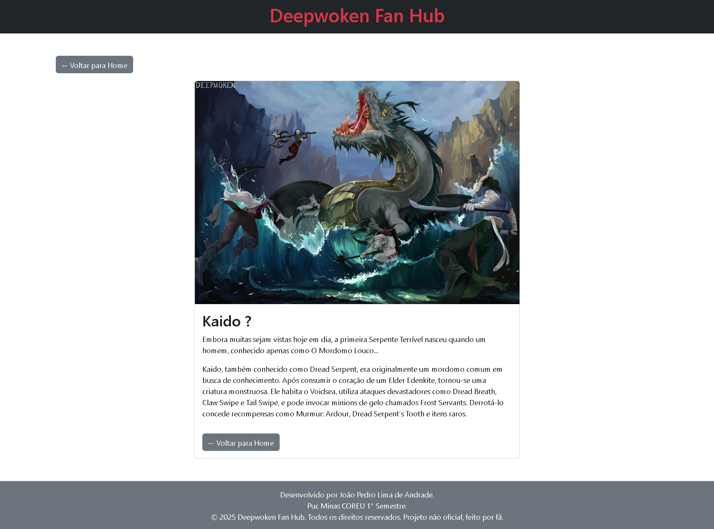
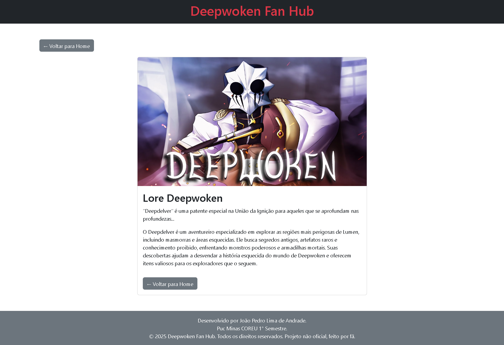
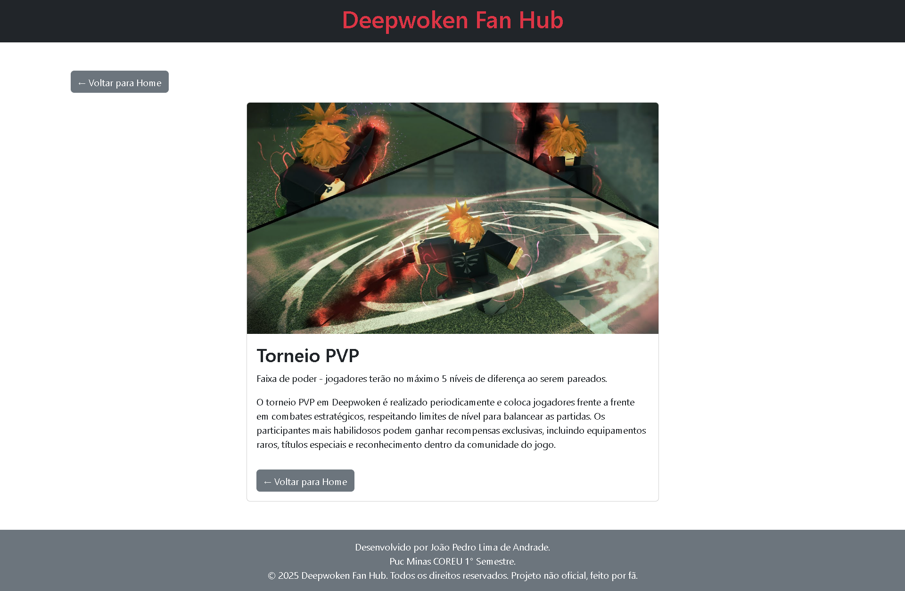

# Trabalho Prático 05 - Semanas 7 e 8

**Páginas de detalhes dinâmicas**

Nessa etapa, vamos evoluir o trabalho anterior, acrescentando a página de detalhes, conforme o  projeto escolhido. Imagine que a página principal (home-page) mostre um visão dos vários itens que existem no seu site. Ao clicar em um item, você é direcionado pra a página de detalhes. A página de detalhe vai mostrar todas as informações sobre o item do seu projeto. seja esse item uma notícia, filme, receita, lugar turístico ou evento.

Leia o enunciado completo no Canvas. 

**IMPORTANTE:** Assim como informado anteriormente, capriche na etapa pois você vai precisar dessa parte para as próximas semanas. 

**IMPORTANTE:** Você deve trabalhar e alterar apenas arquivos dentro da pasta **`public`,** mantendo os arquivos **`index.html`**, **`styles.css`** e **`app.js`** com estes nomes, conforme enunciado. Deixe todos os demais arquivos e pastas desse repositório inalterados. **PRESTE MUITA ATENÇÃO NISSO.**

## Informações Gerais

- Nome: João Pedro Lima de Andrade.
- Matricula: 885317
- Proposta de projeto escolhida: 5. Temas e Conteúdos Associados.
- Breve descrição sobre seu projeto: Deepwoken Fan Hub será uma aplicação web criada para a comunidade de deepwoken, onde será possivel visualizar informações importantes sobre o jogo, e os jogadores poderao interagir entre si de diversas maneiras.

## Print da Home-Page


## Print da página de detalhes do item

## Kaido

## Lore

## Deep Owl

## Torneio PVP

## Enforcer

## Evento especial


## Cole aqui abaixo a estrutura JSON utilizada no app.js

```javascript
const posts = [
    {
        titulo: "Kaido ?",
        descricao: "Embora muitas sejam vistas hoje em dia, a primeira Serpente Terrível nasceu quando um homem, conhecido apenas como O Mordomo Louco...",
        imagem: "Imagens/Conteudo_posts/wp11599134-deepwoken-wallpapers (1).jpg",
        link: "#",
        detalhesExtras: "Kaido, também conhecido como Dread Serpent, era originalmente um mordomo comum em busca de conhecimento. Após consumir o coração de um Elder Edenkite, tornou-se uma criatura monstruosa. Ele habita o Voidsea, utiliza ataques devastadores como Dread Breath, Claw Swipe e Tail Swipe, e pode invocar minions de gelo chamados Frost Servants. Derrotá-lo concede recompensas como Murmur: Ardour, Dread Serpent's Tooth e itens raros."

    },
    {
        titulo: "Deep Owl's",
        descricao: "As Corujas Profundas chegam a Lumen vindas de uma dimensão inconcebível...",
        imagem: "Imagens/Conteudo_posts/DEEEPowl.jpg",
        link: "#",
        detalhesExtras: "As Corujas Profundas são criaturas raras que habitam regiões como Upper Erisia, The Lordsgrove e The Depths. Elas fazem parte de um coletivo mental conhecido como The Nestmind e possuem habilidades relacionadas à magia de ilusão. Sua presença é sinalizada por uma chuva de penas negras que caem ao redor da área. Durante o encontro, elas tentam iniciar um diálogo, sendo não hostis a menos que o jogador as ataque ou vire as costas. As versões corrompidas encontradas nas profundezas possuem maior saúde e poder de ataque. Derrotá-las pode conceder penas raras e desbloquear o juramento Visionshaper."
    },
    {
        titulo: "Lore Deepwoken",
        descricao: "\"Deepdelver\" é uma patente especial na União da Ignição para aqueles que se aprofundam nas profundezas...",
        imagem: "Imagens/Conteudo_posts/wp11599145-deepwoken-wallpapers.jpg",
        link: "#",
        detalhesExtras: "O Deepdelver é um aventureiro especializado em explorar as regiões mais perigosas de Lumen, incluindo masmorras e áreas esquecidas. Ele busca segredos antigos, artefatos raros e conhecimento proibido, enfrentando monstros poderosos e armadilhas mortais. Suas descobertas ajudam a desvendar a história esquecida do mundo de Deepwoken e oferecem itens valiosos para os exploradores que o seguem."
    },
    {
        titulo: "Torneio PVP",
        descricao: "Faixa de poder - jogadores terão no máximo 5 níveis de diferença ao serem pareados.",
        imagem: "Imagens/Conteudo_posts/wp11599208-deepwoken-wallpapers.jpg",
        link: "#",
        detalhesExtras: "O torneio PVP em Deepwoken é realizado periodicamente e coloca jogadores frente a frente em combates estratégicos, respeitando limites de nível para balancear as partidas. Os participantes mais habilidosos podem ganhar recompensas exclusivas, incluindo equipamentos raros, títulos especiais e reconhecimento dentro da comunidade do jogo."
    },
    {
        titulo: "Como matar o Enforcer",
        descricao: "O Enforcer é um Mini-Chefe das Profundezas que atua como o penúltimo teste dos Testes das Profundezas...",
        imagem: "Imagens/Conteudo_posts/Enforcer.jpg",
        link: "#",
        detalhesExtras: "O Enforcer é um Mini-Chefe das Profundezas em Deepwoken, extremamente poderoso e resistente. Dica: utilize ataques rápidos e fique atento aos padrões de movimento para derrotá-lo sem sofrer muito dano. Mantenha a mobilidade, evite ataques diretos quando ele usa projéteis de energia e aproveite momentos de abertura após seus golpes pesados. Derrotá-lo garante equipamentos raros e materiais valiosos para evoluir habilidades."
    },
    {
        titulo: "Evento Especial",
        descricao: "Eventos mundiais ocorrem em cada servidor uma vez a cada hora real (às XX:00).",
        imagem: "Imagens/Conteudo_posts/Deepwoken_post.avif",
        link: "#",
        detalhesExtras: "Os eventos especiais em Deepwoken ocorrem periodicamente e oferecem desafios únicos aos jogadores. Participar desses eventos concede recompensas exclusivas, como equipamentos raros, materiais especiais e habilidades únicas, que não podem ser obtidas de outra forma. É uma ótima oportunidade para testar estratégias, enfrentar inimigos poderosos e se destacar dentro da comunidade do jogo."
    }
];
```